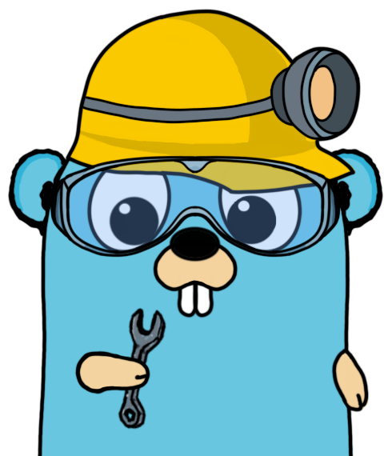

<p align="center">
  
</p>

<p align="center">
<a href="https://pkg.go.dev/github.com/mtnmunuklu/alterix"></a> <a href="https://goreportcard.com/report/github.com/mtnmunuklu/alterix"></a> <a href="https://travis-ci.com/"></a> 

# Alterix

Alterix is a tool that converts Sigma rules to the query language of CRYPTTECH's next-generation SIEM product.

## Table of Contents

- [Overview](#overview)
- [Installation](#installation)
  - [Normal Installation](#normal-installation)
  - [Docker Installation](#docker-installation)
- [Usage](#usage)
  - [Normal Usage](#normal-usage)
  - [Docker Usage](#docker-usage)
- [Contributing](#contributing)
- [Acknowledgement](#acknowledgement)
- [Sponsors](#sponsors)
- [License](#license)

## Overview

Sigma is an open-source project that provides a rule format and a set of tools for the creation and sharing of detection rules for security operations. CRYPTTECH's SIEM product uses a proprietary query language for searching through logs and identifying security events. Alterix serves as a bridge between the two, allowing security teams to leverage their existing Sigma rule sets with the advanced capabilities of CRYPTTECH's SIEM product.

## Installation
To use Alterix, you have two options for installation:
### Normal Installation
Alterix provides precompiled ZIP files for different platforms. You can download the appropriate ZIP file for your platform from the following links:

- [Windows](https://github.com/mtnmunuklu/alterix/releases/latest/download/alterix-windows-latest.zip)
- [Linux](https://github.com/mtnmunuklu/alterix/releases/latest/download/alterix-ubuntu-latest.zip)
- [macOS](https://github.com/mtnmunuklu/alterix/releases/latest/download/alterix-macos-latest.zip)

Once you have downloaded the ZIP file for your platform, extract it to a directory of your choice. The extracted files will include the Alterix executable.

Make sure the directory containing the Alterix executable is added to your system's PATH environment variable, so you can run Alterix from any location in the command line.

Please note that Alterix requires Go to be installed on your system. You can download and install Go from the official website: [https://golang.org/dl/](https://golang.org/dl/)

### Docker Installation

Alternatively, you can use Docker to run Alterix in a containerized environment. Docker provides a convenient and consistent way to set up and use Alterix without worrying about dependencies or system configurations.

To install and set up Alterix using Docker, make sure you have Docker installed on your system. If you don't have it, you can download and install Docker from the official website: https://www.docker.com/get-started

Once Docker is installed, run the provided commands to create a Docker image for Alterix and start the container:

1. **Clone the Repository**: If you haven't done so already, clone the Alterix repository to your local machine:

   ```shell
   git clone https://github.com/mtnmunuklu/alterix.git
   ```
2. **Navigate to Docker Directory**: Go to the docker directory inside the cloned repository:

   ```shell
   cd tools/docker
   ```
3. **Build Docker Image and Start Container**: Use the setup script to build the Docker image named alterix-image:

   ```shell
   go run setup_docker_alterix.go /path/to/rules /path/to/config /path/to/output
   ```
   
   This script will handle the building of the Docker image and starting the container for you.

That's it! You have successfully installed Alterix on your system. You can now proceed to the [Usage](#usage) section to learn how to use Alterix.

If you prefer to build Alterix from source, you can refer to the [Build Instructions](BUILD.md) for detailed steps on how to build and install it on your platform.

## Usage

To use Alterix, you will need Sigma rules and a configuration file for CRYPTTECH's SIEM product. Sigma rules are written in YAML format and can be found in the Sigma GitHub repository: https://github.com/Neo23x0/sigma/tree/master/rules

The configuration file for CRYPTTECH's SIEM product should be obtained from your system administrator.

### Normal Usage

To convert Sigma rules to the query language of CRYPTTECH's SIEM product in your local environment, follow these steps:

1. Prepare Sigma rules and a configuration file.
2. Convert Sigma rules to the query language of CRYPTTECH's SIEM product by running the following command:

    ```shell
    ./alterix -filepath <path-to-rules> -config <path-to-config> [-json] [-output <output-directory>]
    ```
    or
    ```shell
    ./alterix -filecontent <content-to-rules> -configcontent <content-to-config> [-json] [-output <output-directory>]
    ```

### Docker Usage

If you have installed Alterix using Docker, you can use the following command to run Alterix inside the Docker container:

```shell
docker exec alterix ./alterix -filepath <path-to-rules> -config <path-to-config> [-json] [-output <output-directory>]
```
or
```shell
docker exec alterix ./alterix -filecontent <content-to-rules> -configcontent <content-to-config> [-json] [-output <output-directory>]
```

The `filepath` flag specifies the location of the Sigma rules. This can be a file or directory path.

The `filecontent` flag allows you to provide the Base64-encoded content of Sigma rules directly as a string.

The `config` flag specifies the location of the configuration file for CRYPTTECH's SIEM product.

The `configcontent` flag allows you to provide the Base64-encoded content of the configuration file directly as a string.

The `json` flag indicates that the output should be in JSON format.

The `output` flag specifies the directory where the output files should be written.

If the json flag is provided, Alterix will convert the Sigma rules to JSON format. If the output flag is provided, Alterix will save the output files to the specified directory. If neither flag is provided, the output will be displayed in the console.


## Contributing

Contributions to Alterix are welcome and encouraged! Please read the [contribution guidelines](CONTRIBUTING.md) before making any contributions to the project.

## Acknowledgements

This project was inspired by the work of Bradley Kemp, whose original repository can be found [here](https://github.com/bradleyjkemp/sigma-go). We would like to thank Bradley for his valuable contribution to the community and for making his code available to us.

We also want to thank the creators of the Sigma project, whose rule format we use in this project. More information about Sigma can be found [here](https://github.com/Neo23x0/sigma).

## Sponsors

We would like to express our gratitude to the following sponsors for their generous support:

<div align="center">
  <a href="https://github.com/th3gundy">
    
  </a>
  <a href="https://github.com/tolgaakkapulu">
    
  </a>
  <a href="https://github.com/mkdemir">
    
  </a>
  <!-- Diğer sponsorlar -->
</div>


If you are interested in becoming a sponsor, please visit our [GitHub Sponsors](https://github.com/sponsors/mtnmunuklu) page.

## License

Alterix is licensed under the MIT License. See [LICENSE](LICENSE) for the full text of the license.
